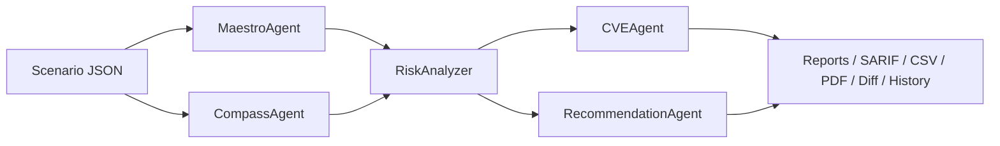

# Architecture

The pipeline is a deterministic chain of small agents joined by a stable schema.

Every agent emits the same canonical schema, so you can swap any of them out (e.g. the LLM-backed agents in `agents/llm_agents.py`) without touching the downstream code.

## Layers

- **`agents/`** — keyword and LLM-backed analysers
- **`utils/`** — exporters (Markdown, HTML, SARIF, CSV, PDF), schema, plugins, cache, history, diff, scoring, webhook, MCP
- **`main.py`** — CLI entry point and pipeline orchestrator
- **`web/`** — optional FastAPI app
- **`mcp_server.py`** — optional MCP server
